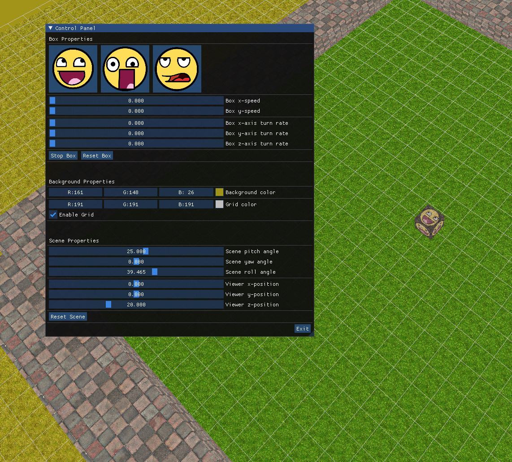

# Bounce-GL

This is a box that bounces between walls. The box's skin and movement, as well as the scene's and the camera's orientation can be adjusted via graphical controls.

This project was heavily inspired by the classic bounce.c (<https://www.opengl.org/archives/resources/code/samples/glut_examples/mesademos/bounce.c>) but is built using modern OpenGL.

A port to Webassembly + WebGL can be found at <https://github.com/sam-ysf/Bounce-GL-wasm> alongside a live demo at <https://sam-ysf.github.io>.





Installation
--------------------------------------------------------------------------------
To compile and run, first ensure that you have the necessary build tools and the SDL2 library installed (`apt install build-essential cmake libsdl2-dev` on Debian systems).

```Bash
mkdir Bounce-GL/debug && cd Bounce-GL/debug
cmake ..
cmake --build .
cmake --install . # To install to /usr/local/bin/bounce
```

Third-party
--------------------------------------------------------------------------------
Dear ImGui is used for the control panel\
<https://github.com/ocornut/imgui>

The stb library is used for texture loading\
<https://github.com/nothings/stb>


--------------------------------------------------------------------------------
This software is entirely in the public domain and is provided as is, without restricitions. See the LICENSE for more information.
